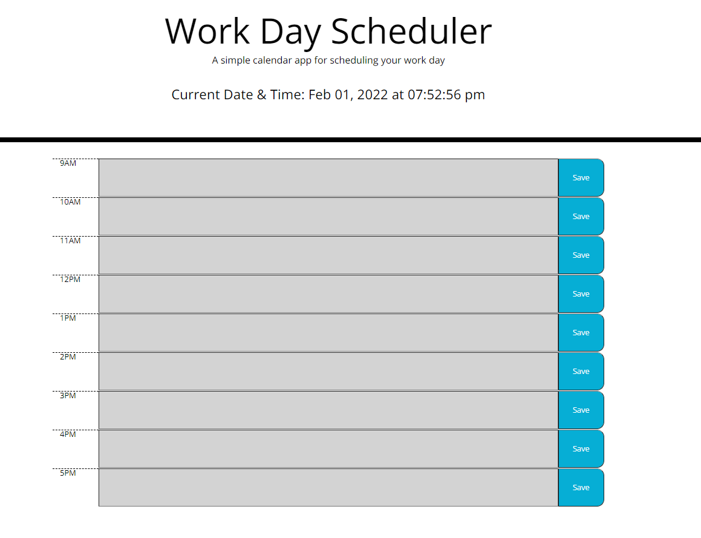

# work-day-planner

## Description

I have created a colored coded business planner for the work day. It reminds the user of the current date and time as well as allows for saving of your event for its appropriate time slot. Using local storage allows retrieval of the event item so that it is never lost for the user.

## Installation

Used JavaScript, jQuery and moment.js

